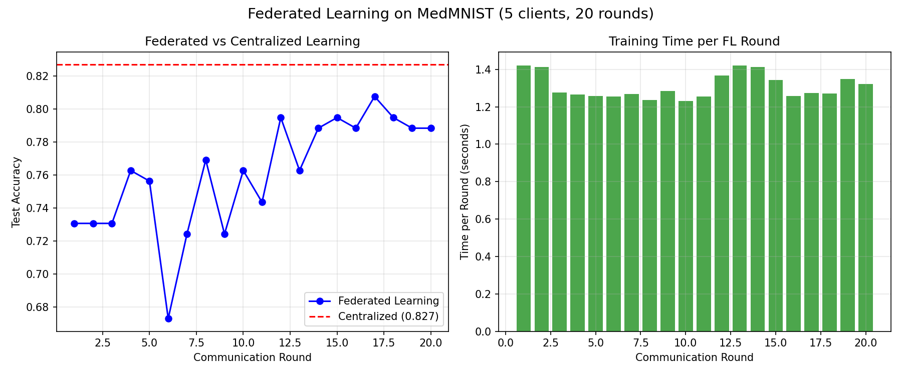

# Federated Learning for Medical Image Classification with MedMNIST

## Overview
This project implements federated learning (FedAvg) for medical image classification using the MedMNIST BreastMNIST dataset. The data is split into 5 non-IID clients simulating different hospitals with varying disease distributions (some hospitals have more benign cases, others more malignant).

## Dataset
- **BreastMNIST**: Breast ultrasound images for benign/malignant classification
- **Size**: 546 training samples, 78 validation, 156 test
- **Image format**: 28×28 grayscale
- **Task**: Binary classification (0 = benign, 1 = malignant)

## Data Storage

The MedMNIST library automatically downloads datasets to a central cache:
- Windows: `%USERPROFILE%\.medmnist\`
- Linux/Mac: `~/.medmnist/`

No manual download is required. The dataset is loaded from this cache location.

## Results

### Centralized Baseline (10 epochs)
- **Test Accuracy**: 82.69%
- **Best Validation Accuracy**: 87.18% (Epoch 8)

### Federated Learning (20 rounds, 5 clients, 3 local epochs)
- **Final Test Accuracy**: 78.85%
- **Gap to Centralized**: 3.84%

### Client Distribution (Non-IID)

The data was split across 5 clients simulating different hospitals with varying disease prevalence:

| Client | Samples | Class 0 (benign) | Class 1 (malignant) | Interpretation |
|--------|---------|------------------|---------------------|----------------|
| Client 0 | 33 | 2 | 31 | Mostly malignant |
| Client 1 | 115 | 80 | 35 | Mixed, more benign |
| Client 2 | 19 | 13 | 6 | Mixed, more benign |
| Client 3 | 42 | 42 | 0 | Only benign cases |
| Client 4 | 331 | 7 | 324 | Mostly malignant |

## Visualizations


The plot shows:
- **Left**: Federated learning test accuracy over 20 rounds (blue) vs centralized baseline (red dashed)
- **Right**: Time per communication round

## How to Run

```bash
# Install dependencies
pip install -r requirements.txt

# Run centralized baseline
python experiments/run_centralized.py

# Run federated learning
python experiments/run_federated.py

```
## Limitations

This project is a proof-of-concept demonstration. Key limitations:

- **Small dataset**: BreastMNIST has only 546 training samples (due to internet constraints)
- **CPU training**: All experiments ran on CPU (not GPU)
- **Simulated clients**: Clients are synthetic splits, not real hospital data
- **Binary classification**: Only benign vs malignant (not multi-class)

Despite these limitations, the implementation demonstrates core federated learning competencies: FedAvg aggregation, non-IID data partitioning, client-server architecture, and reproducible experimentation.

# Author
Project completed as part of portfolio for graduate programs applications in federated learning and health AI.